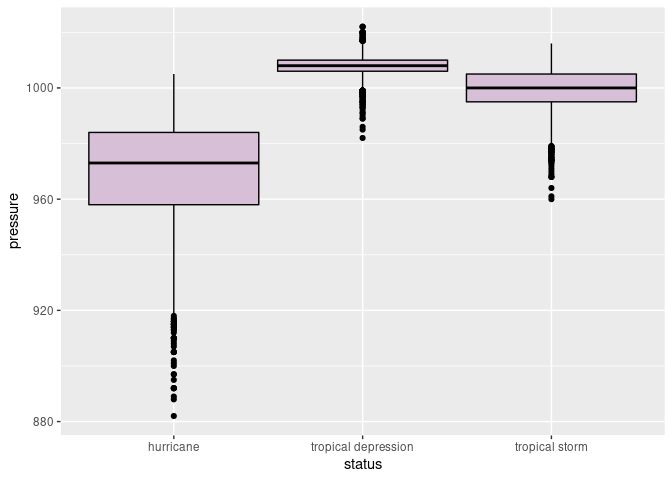

hw02-Kaylei-Nilson
================
Kaylei
9/14/2020

``` r
# 1(a)
nrow(storms)
```

    ## [1] 10010

``` r
# 1(b)
ncol(storms)
```

    ## [1] 13

1(c) Tibbles are a newer version of data frames. Tibbles mainly differ
from traditional data frames in printing and subsetting abilities.

1(d) These abbreviations refer to each columns type and is found through
using str() which describes the structure of an object.

``` r
# 2(a)

specific_year <- filter(storms, year == 1980)
nrow(specific_year)
```

    ## [1] 161

``` r
# 2(b)

unique_year <- distinct(select(specific_year, name))
unique_year
```

    ## # A tibble: 8 x 1
    ##   name    
    ##   <chr>   
    ## 1 Bonnie  
    ## 2 Charley 
    ## 3 Georges 
    ## 4 Danielle
    ## 5 Hermine 
    ## 6 Ivan    
    ## 7 Jeanne  
    ## 8 Karl

``` r
# 2(c)

arrange(unique_year, (desc(name)))
```

    ## # A tibble: 8 x 1
    ##   name    
    ##   <chr>   
    ## 1 Karl    
    ## 2 Jeanne  
    ## 3 Ivan    
    ## 4 Hermine 
    ## 5 Georges 
    ## 6 Danielle
    ## 7 Charley 
    ## 8 Bonnie

``` r
# 2(d)

by_records <-  group_by(specific_year, name)
nrecords <- count(by_records)
arrange(nrecords, n)
```

    ## # A tibble: 8 x 2
    ## # Groups:   name [8]
    ##   name         n
    ##   <chr>    <int>
    ## 1 Karl         9
    ## 2 Charley     12
    ## 3 Danielle    12
    ## 4 Georges     21
    ## 5 Bonnie      23
    ## 6 Hermine     23
    ## 7 Ivan        30
    ## 8 Jeanne      31

``` r
# 3(a)

decade <- filter(storms, year == 1990:1999)
unique_decade <- distinct(select(decade, name, year))
first_five <- head(unique_decade,5)
last_five <- tail(unique_decade,5)
#storm_names_1990s <- rbind(first_five, last_five)
first_five
```

    ## # A tibble: 5 x 2
    ##   name     year
    ##   <chr>   <dbl>
    ## 1 Arthur   1990
    ## 2 Cesar    1990
    ## 3 Edouard  1990
    ## 4 Diana    1990
    ## 5 Gustav   1990

``` r
last_five
```

    ## # A tibble: 5 x 2
    ##   name      year
    ##   <chr>    <dbl>
    ## 1 Harvey    1999
    ## 2 AL111999  1999
    ## 3 AL121999  1999
    ## 4 Katrina   1999
    ## 5 Lenny     1999

``` r
# 3(b)

unique_storm <- distinct(select(storms, name, year))
by_year <-  group_by(unique_storm, year)
storms_per_year <- count(by_year)
head(storms_per_year, 15)
```

    ## # A tibble: 15 x 2
    ## # Groups:   year [15]
    ##     year     n
    ##    <dbl> <int>
    ##  1  1975     3
    ##  2  1976     2
    ##  3  1977     3
    ##  4  1978     4
    ##  5  1979     7
    ##  6  1980     8
    ##  7  1981     5
    ##  8  1982     5
    ##  9  1983     4
    ## 10  1984    10
    ## 11  1985    10
    ## 12  1986     4
    ## 13  1987     3
    ## 14  1988    10
    ## 15  1989    11

``` r
# main method for 3(c)

storm_records_per_year <- summarise(
  group_by(storms, name, year),
  number = n()
)
```

    ## `summarise()` regrouping output by 'name' (override with `.groups` argument)

``` r
chron_storm_per_year <- arrange(storm_records_per_year, year)

head(chron_storm_per_year, 10)
```

    ## # A tibble: 10 x 3
    ## # Groups:   name [10]
    ##    name      year number
    ##    <chr>    <dbl>  <int>
    ##  1 Amy       1975     30
    ##  2 Caroline  1975     33
    ##  3 Doris     1975     23
    ##  4 Belle     1976     18
    ##  5 Gloria    1976     34
    ##  6 Anita     1977     20
    ##  7 Clara     1977     24
    ##  8 Evelyn    1977      9
    ##  9 Amelia    1978      6
    ## 10 Bess      1978     13

``` r
tail(chron_storm_per_year, 10)
```

    ## # A tibble: 10 x 3
    ## # Groups:   name [10]
    ##    name       year number
    ##    <chr>     <dbl>  <int>
    ##  1 Bill       2015     12
    ##  2 Claudette  2015      7
    ##  3 Danny      2015     26
    ##  4 Erika      2015     16
    ##  5 Fred       2015     31
    ##  6 Henri      2015     11
    ##  7 Ida        2015     37
    ##  8 Joaquin    2015     42
    ##  9 Kate       2015     13
    ## 10 Nine       2015     13

``` r
# 4(a)

decade <- filter(storms, year == 1990:1999)
decade_storms <- summarise(
  group_by(decade, year),
  number = n()
)
```

    ## `summarise()` ungrouping output (override with `.groups` argument)

``` r
decade_storms
```

    ## # A tibble: 10 x 2
    ##     year number
    ##    <dbl>  <int>
    ##  1  1990     36
    ##  2  1991     13
    ##  3  1992     18
    ##  4  1993     13
    ##  5  1994     20
    ##  6  1995     66
    ##  7  1996     32
    ##  8  1997     15
    ##  9  1998     41
    ## 10  1999     21

``` r
# 4(a)

ggplot(data=decade_storms, aes(x=factor(year), y=number)) +
  geom_bar(stat="identity", color= "black", fill= "#CC79A7")
```

<!-- -->

``` r
# 4(b)

ggplot(data=storms, aes(wind))+
  geom_histogram(color= "black", fill="slategray3", bins=25)
```

<!-- -->

``` r
# 4(c)

ggplot(storms, aes(x=pressure))+
  geom_density(color="indianred", fill="thistle2")
```

<!-- -->

``` r
# 4(d)

Year90to09 <- filter(storms, year %in% 1990:2009)


ggplot(Year90to09, aes(x=pressure))+
  facet_wrap(~year) +
  geom_density(color= "indianred", fill="thistle2")
```

<!-- -->

``` r
# 4(e)

wind_storms <- summarise(
  group_by (storms, year),
  wind_avg = mean(wind)
)
```

    ## `summarise()` ungrouping output (override with `.groups` argument)

``` r
ggplot (wind_storms, aes(x=year, y=wind_avg)) +
  geom_line() + 
  geom_point()
```

<!-- -->

``` r
# 5(a)

distinct_status <- distinct(storms, status)
distinct_status
```

    ## # A tibble: 3 x 1
    ##   status             
    ##   <chr>              
    ## 1 tropical depression
    ## 2 tropical storm     
    ## 3 hurricane

``` r
# 5(b)

distinct_category <- distinct (storms, category)
distinct_category
```

    ## # A tibble: 7 x 1
    ##   category
    ##   <ord>   
    ## 1 -1      
    ## 2 0       
    ## 3 1       
    ## 4 3       
    ## 5 2       
    ## 6 5       
    ## 7 4

``` r
# 5(c)

summarise(
  group_by (storms, status, category)
)
```

    ## `summarise()` regrouping output by 'status' (override with `.groups` argument)

    ## # A tibble: 8 x 2
    ## # Groups:   status [3]
    ##   status              category
    ##   <chr>               <ord>   
    ## 1 hurricane           1       
    ## 2 hurricane           2       
    ## 3 hurricane           3       
    ## 4 hurricane           4       
    ## 5 hurricane           5       
    ## 6 tropical depression -1      
    ## 7 tropical storm      0       
    ## 8 tropical storm      1

``` r
# 5(d)

summarise(
  group_by (storms,category, status),
  avg_pressure= mean(pressure),
  avg_wind= mean(wind),
)
```

    ## `summarise()` regrouping output by 'category' (override with `.groups` argument)

    ## # A tibble: 8 x 4
    ## # Groups:   category [7]
    ##   category status              avg_pressure avg_wind
    ##   <ord>    <chr>                      <dbl>    <dbl>
    ## 1 -1       tropical depression        1008.     27.3
    ## 2 0        tropical storm              999.     45.8
    ## 3 1        hurricane                   982.     70.9
    ## 4 1        tropical storm              975      70  
    ## 5 2        hurricane                   967.     89.4
    ## 6 3        hurricane                   954.    105. 
    ## 7 4        hurricane                   940.    122. 
    ## 8 5        hurricane                   916.    145.

``` r
# 5(e)

ggplot(storms, aes(x= status, y=pressure)) +
  geom_boxplot(color= "black", fill= "thistle", width= 0.9)
```

<!-- -->

``` r
# 6

ggplot(storms, aes(x=wind, y=pressure)) +
  geom_point(aes(color=category))
```

<!-- -->

``` r
# 7

max_wind_per_storm <- summarise(
  group_by (storms, year, name),
  max_wind= max(wind)
)
```

    ## `summarise()` regrouping output by 'year' (override with `.groups` argument)

``` r
head(max_wind_per_storm, 10)
```

    ## # A tibble: 10 x 3
    ## # Groups:   year [4]
    ##     year name     max_wind
    ##    <dbl> <chr>       <int>
    ##  1  1975 Amy            60
    ##  2  1975 Caroline      100
    ##  3  1975 Doris          95
    ##  4  1976 Belle         105
    ##  5  1976 Gloria         90
    ##  6  1977 Anita         150
    ##  7  1977 Clara          65
    ##  8  1977 Evelyn         70
    ##  9  1978 Amelia         45
    ## 10  1978 Bess           45

``` r
tail(max_wind_per_storm,10)
```

    ## # A tibble: 10 x 3
    ## # Groups:   year [1]
    ##     year name      max_wind
    ##    <dbl> <chr>        <int>
    ##  1  2015 Bill            50
    ##  2  2015 Claudette       45
    ##  3  2015 Danny          110
    ##  4  2015 Erika           45
    ##  5  2015 Fred            75
    ##  6  2015 Henri           45
    ##  7  2015 Ida             45
    ##  8  2015 Joaquin        135
    ##  9  2015 Kate            75
    ## 10  2015 Nine            30

``` r
# 8

max_wind_per_year <- storms %>%
  group_by(year) %>%
  summarise(name=name[which.max(wind)], wind=max(wind))
```

    ## `summarise()` ungrouping output (override with `.groups` argument)

``` r
chron_max_wind <- arrange(max_wind_per_year, desc(wind))

head(chron_max_wind, 10)
```

    ## # A tibble: 10 x 3
    ##     year name     wind
    ##    <dbl> <chr>   <int>
    ##  1  1988 Gilbert   160
    ##  2  2005 Wilma     160
    ##  3  1998 Mitch     155
    ##  4  1977 Anita     150
    ##  5  1979 David     150
    ##  6  1992 Andrew    150
    ##  7  2007 Dean      150
    ##  8  2003 Isabel    145
    ##  9  2004 Ivan      145
    ## 10  1989 Hugo      140

``` r
tail(chron_max_wind, 10)
```

    ## # A tibble: 10 x 3
    ##     year name      wind
    ##    <dbl> <chr>    <int>
    ##  1  2006 Gordon     105
    ##  2  1975 Caroline   100
    ##  3  1983 Alicia     100
    ##  4  1993 Emily      100
    ##  5  2012 Michael    100
    ##  6  1980 Ivan        90
    ##  7  1978 Cora        80
    ##  8  2013 Humberto    80
    ##  9  1986 Bonnie      75
    ## 10  1994 Gordon      75
